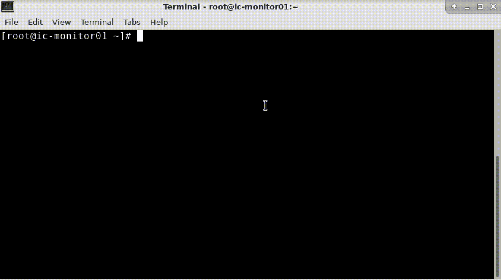

**Author:** liyanqing1987@163.com    
**Version:** V1.1 (2025.02.10)    
    
# What is “safe_rm”?
 
 `safe_rm` is a secure data deletion tool, which works exactly the same as `rm`. It can be referenced in an alias manner or directly replace the system's rm command.

# Requirements

- Linux
- Python 3

# Quick Start

1.  use as alias    

     `[user@host ~]# alias rm=“/***/safe_rm“`    
     
         

2.  replace system rm    

     `[root@host ~]# which rm`    
     `/usr/bin/rm`    
     `[root@host ~]# mv /usr/bin/rm /usr/bin/system_rm`    
     `[root@host ~]# cp safe_rm /usr/bin/rm`    
     
      

# Configuration

1. Recommended configuration    

     Specify recycle bin path: `self.recycle_bin_dir = ''`    
     Specify log directory: `self.log_dir = ''`    
     How to send alarm: `self.alarm_command = ''`    

2. Optional configuration    

     Specify protect path for yourself: `~/.config/safe_rm.protected`    
     Specify recycle bin path for yourself: `~/.config/safe_rm.recycle`    

# Docs

More usage information please see [User Manual](safe_rm_user_manual.pdf)
